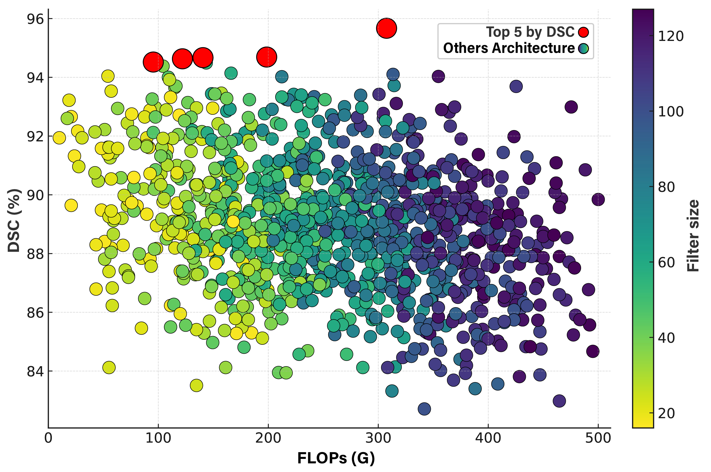
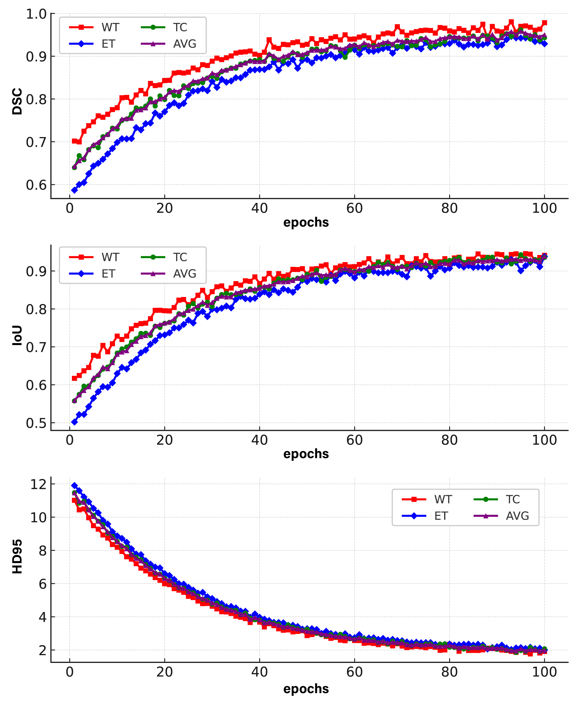
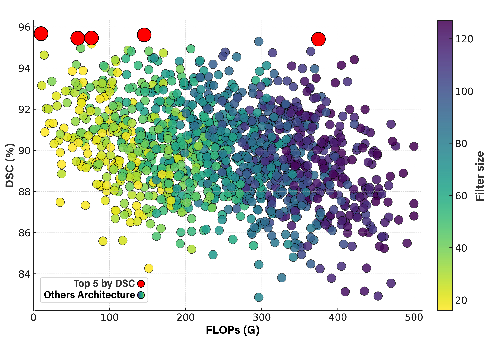
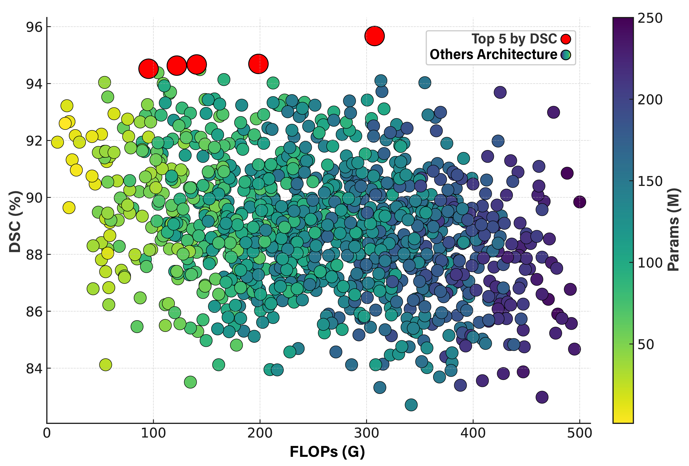
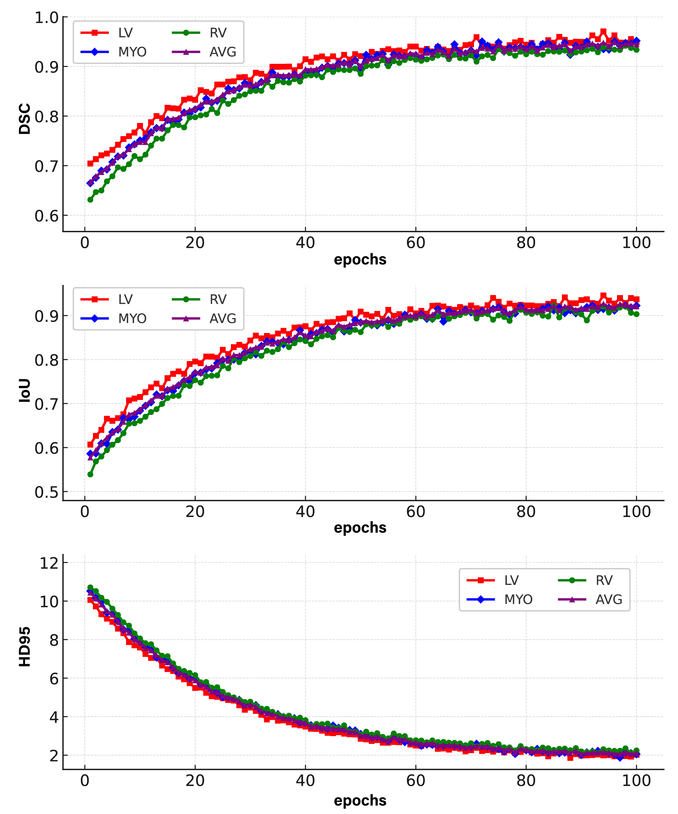

# EvoSegNet: Supplementary Material

This repository contains supplementary experimental results and architectural analysis for:

**EvoSegNet: Multi-Scale and Uncertainty-Aware Evolutionary Neural Architecture Search for Efficient 3D Medical Image Segmentation**

---

## 1. BraTS 2021 – Architectural Search Analysis

### DSC vs FLOPs vs Filters

  

### DSC vs FLOPs vs Parameters

  

### Training Metrics (DSC, HD95, IoU)

  

---

## 2. ACDC – Architectural Search Analysis

### DSC vs FLOPs vs Filters

  

### DSC vs FLOPs vs Parameters

  

### Training Metrics (DSC, HD95, IoU)

  

---

## Reproducibility

All experiments were conducted under the following configuration:

- Framework: TensorFlow
- GPU Acceleration: CUDA + cuDNN
- Hardware: NVIDIA RTX 3090
- Fixed random seeds for deterministic behaviour
- Identical dataset splits and search settings as described in the manuscript

---

## Description

The figures above illustrate:

- Multi-objective Pareto search behaviour (DSC vs computational complexity)
- Trade-offs between segmentation accuracy, parameter count, and FLOPs
- Convergence dynamics in terms of DSC, HD95, and IoU
- Stability of the evolutionary optimisation process

These supplementary results provide further evidence of EvoSegNet’s efficiency–accuracy balance across both brain tumour (BraTS 2021) and cardiac (ACDC) segmentation benchmarks.
