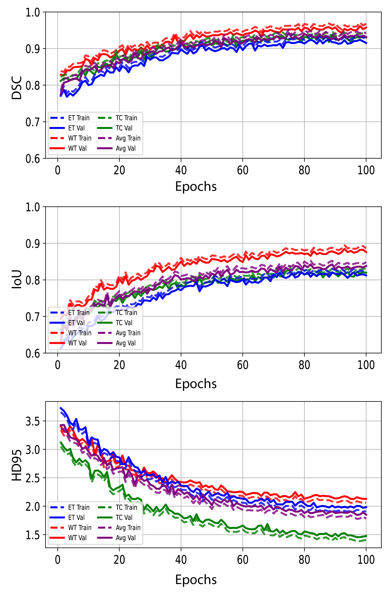
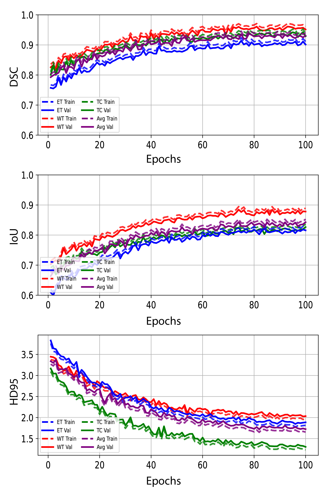
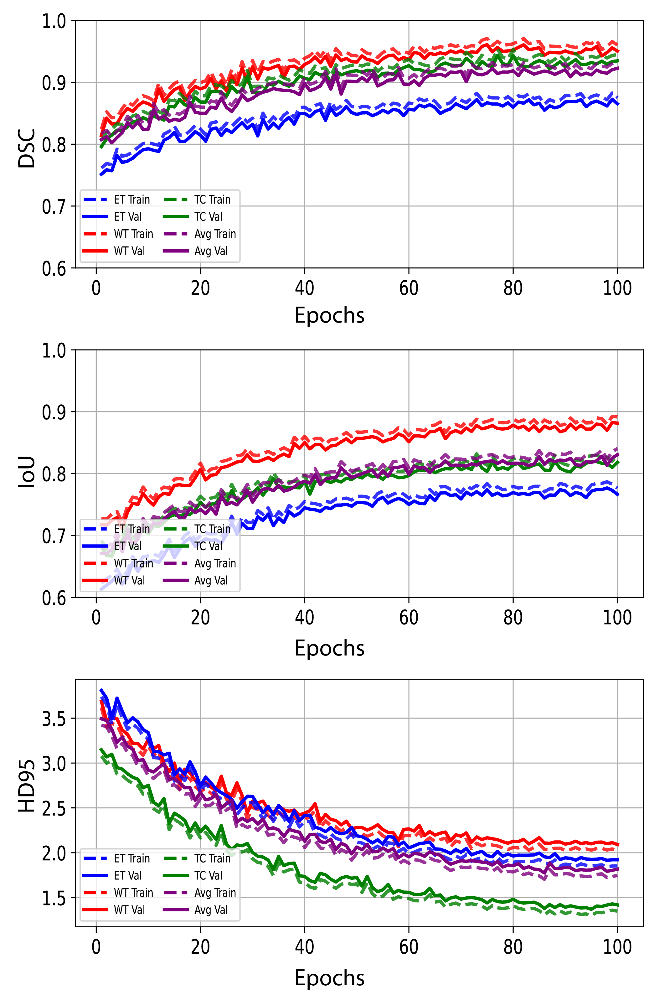
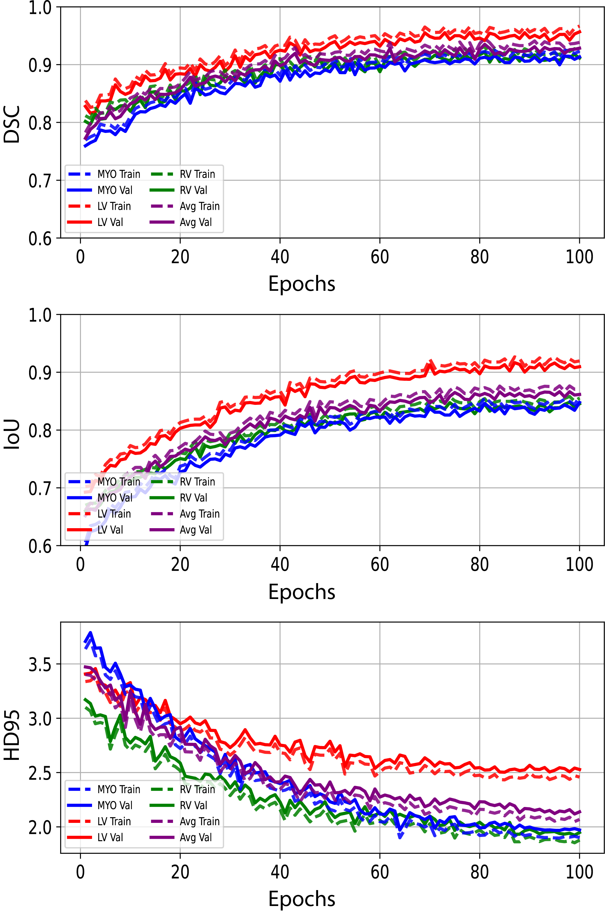
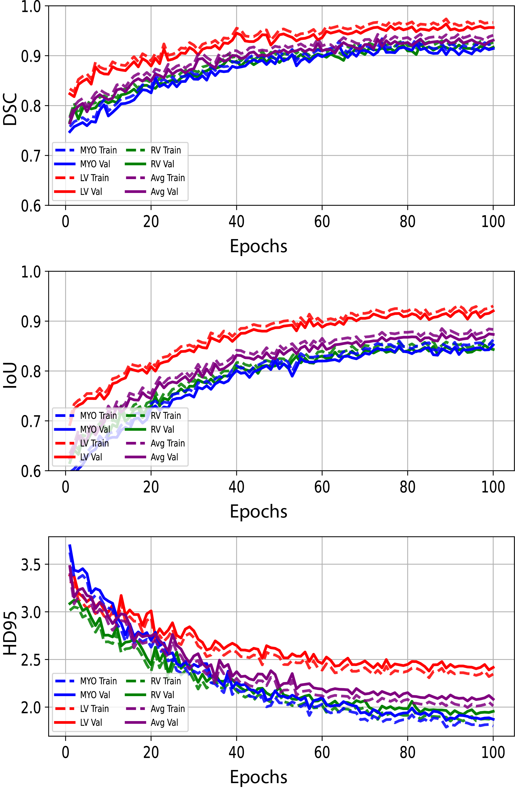
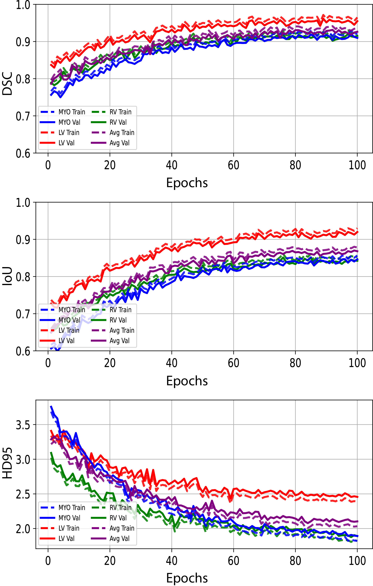

# EvoSegNet: Supplementary Material
This repository contains supplementary experimental results and architectural analysis for:

**EvoSegNet: Multi-Scale and Uncertainty-Aware Evolutionary Neural Architecture Search for Efficient 3D Medical Image Segmentation**

---

## 1. BraTS 2021 – Architectural Search Analysis

### DSC vs FLOPs vs Filters

  

### DSC vs FLOPs vs Parameters

  

---

## 2. ACDC – Architectural Search Analysis

### DSC vs FLOPs vs Filters

  

### DSC vs FLOPs vs Parameters

  

---

## Reproducibility

All experiments were conducted under the following configuration:

- Framework: TensorFlow
- GPU Acceleration: CUDA + cuDNN
- Hardware: NVIDIA RTX 3090
- Fixed random seeds for deterministic behaviour
- Identical dataset splits and search settings as described in the manuscript

---

## Description

The figures above illustrate:

- Multi-objective Pareto search behaviour (DSC vs computational complexity)
- Trade-offs between segmentation accuracy, parameter count, and FLOPs
- Convergence dynamics in terms of DSC, HD95, and IoU
- Stability of the evolutionary optimisation process

These supplementary results provide further evidence of EvoSegNet’s efficiency–accuracy balance across both brain tumour (BraTS 2021) and cardiac (ACDC) segmentation benchmarks.

<h2>Independent Run Consistency Analysis</h2>

To evaluate training stability and reproducibility, <b>EvoSegNet</b> was trained across 
<b>three independent runs (100 epochs each)</b> on both datasets.
Performance trends include <b>DSC</b>, <b>IoU</b>, and <b>HD95</b> for training and validation phases.

<h3>🧠 BraTS 2021 – Independent Runs</h3>

<h4>🔹 Run 1</h4>

  

<h4>🔹 Run 2</h4>

  

<h4>🔹 Run 3</h4>

  

<h3>❤️ ACDC – Independent Runs</h3>

<h4>🔹 Run 1</h4>

  

<h4>🔹 Run 2</h4>

  

<h4>🔹 Run 3</h4>

  

<h3>📌 Key Observations</h3>

<ul>
  <li>Consistent convergence across all runs</li>
  <li>Minimal variation between training and validation curves</li>
  <li>Stable performance in DSC and IoU</li>
  <li>Gradual reduction in HD95, indicating improved boundary precision</li>
</ul>
